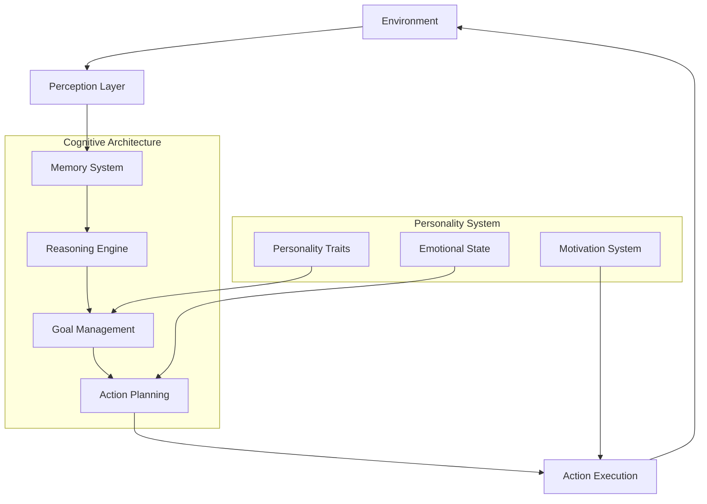

# Agent Design

Agent design in Cognito Simulation Engine follows cognitive science principles to create believable, intelligent, and adaptive artificial agents. Our multi-layered architecture enables sophisticated behaviors while maintaining computational efficiency.

## Agent Architecture Overview



## Core Agent Types

### 1. CognitiveAgent - General Purpose Intelligence

The `CognitiveAgent` provides balanced cognitive capabilities suitable for most simulation scenarios:

```python
from cognito_sim_engine import CognitiveAgent, Environment

# Create a cognitive agent with personality
agent = CognitiveAgent(
    agent_id="alice_researcher",
    personality_traits={
        "openness": 0.8,        # High creativity and curiosity
        "conscientiousness": 0.7, # Organized and goal-oriented
        "extraversion": 0.6,    # Moderately social
        "agreeableness": 0.8,   # Cooperative and trusting
        "neuroticism": 0.3      # Emotionally stable
    },
    cognitive_config={
        "memory_capacity": 1000,
        "reasoning_depth": 8,
        "learning_rate": 0.1,
        "attention_span": 50
    }
)

# Customize agent's capabilities
agent.set_goals([
    Goal("Research novel materials", priority=0.9),
    Goal("Collaborate with team", priority=0.7),
    Goal("Publish findings", priority=0.8)
])

# Add domain knowledge
agent.memory_manager.store_memory(MemoryItem(
    content="Carbon nanotubes have exceptional strength-to-weight ratio",
    memory_type=MemoryType.SEMANTIC,
    relevance=0.9
))
```

**Key Features:**

- **Balanced reasoning**: Combines logical and intuitive thinking
- **Adaptive learning**: Updates knowledge based on experience
- **Social awareness**: Considers other agents in decision-making
- **Emotional intelligence**: Basic emotional state management

### 2. ReasoningAgent - Logical Problem Solver

The `ReasoningAgent` specializes in systematic logical analysis and formal reasoning:

```python
from cognito_sim_engine import ReasoningAgent, Rule, Fact

# Create a reasoning specialist
logic_agent = ReasoningAgent(
    agent_id="dr_logic",
    reasoning_config={
        "inference_strategy": "exhaustive",
        "proof_generation": True,
        "uncertainty_handling": True,
        "max_reasoning_depth": 15
    }
)

# Add specialized reasoning rules
theorem_proving_rules = [
    Rule(
        conditions=[Fact("theorem", ["?t"]), Fact("proof_exists", ["?t"])],
        conclusion=Fact("proven", ["?t"]),
        confidence=0.95,
        name="theorem_proving"
    ),
    Rule(
        conditions=[Fact("axiom", ["?a"]), Fact("derivation_valid", ["?a", "?t"])],
        conclusion=Fact("theorem", ["?t"]),
        confidence=0.9,
        name="theorem_derivation"
    )
]

for rule in theorem_proving_rules:
    logic_agent.inference_engine.reasoner.add_rule(rule)

# Set formal reasoning goals
logic_agent.set_goals([
    Goal("Prove mathematical theorems", priority=1.0),
    Goal("Verify logical consistency", priority=0.9),
    Goal("Generate formal proofs", priority=0.8)
])
```

**Specialized Capabilities:**

- **Formal logic**: First-order and higher-order logic reasoning
- **Proof generation**: Creates step-by-step logical proofs
- **Consistency checking**: Detects and resolves contradictions
- **Symbolic manipulation**: Works with abstract mathematical concepts

### 3. LearningAgent - Adaptive Intelligence

The `LearningAgent` focuses on continuous learning and adaptation:

```python
from cognito_sim_engine import LearningAgent, LearningStrategy

# Create an adaptive learning agent
learner = LearningAgent(
    agent_id="adaptive_alice",
    learning_config={
        "strategy": LearningStrategy.REINFORCEMENT,
        "exploration_rate": 0.2,
        "learning_rate": 0.15,
        "memory_consolidation": True,
        "transfer_learning": True
    }
)

# Configure learning parameters
learner.configure_learning(
    reward_function=lambda action, outcome: calculate_reward(action, outcome),
    experience_replay=True,
    meta_learning=True
)

# Set learning objectives
learner.set_learning_goals([
    "Optimize decision-making speed",
    "Improve prediction accuracy", 
    "Adapt to environmental changes",
    "Transfer knowledge across domains"
])

def calculate_reward(action, outcome):
    """Custom reward function for learning"""
    base_reward = 0.0
    
    if outcome.success:
        base_reward += 1.0
    
    # Bonus for efficiency
    if outcome.execution_time < action.expected_time:
        base_reward += 0.5
    
    # Penalty for errors
    if outcome.errors:
        base_reward -= 0.3 * len(outcome.errors)
    
    return base_reward
```

**Learning Mechanisms:**

- **Reinforcement learning**: Trial-and-error optimization
- **Experience replay**: Learning from past experiences
- **Transfer learning**: Applying knowledge across domains
- **Meta-learning**: Learning how to learn more effectively

### 4. MetaCognitiveAgent - Strategic Thinking

The `MetaCognitiveAgent` excels at thinking about thinking and strategic planning:

```python
from cognito_sim_engine import MetaCognitiveAgent, MetaStrategy

# Create a meta-cognitive agent
meta_agent = MetaCognitiveAgent(
    agent_id="meta_mind",
    meta_config={
        "self_monitoring": True,
        "strategy_selection": True,
        "cognitive_control": True,
        "reflection_depth": 5
    }
)

# Configure meta-cognitive strategies
meta_agent.add_meta_strategy(MetaStrategy(
    name="performance_monitoring",
    trigger_conditions=["task_completion", "error_detected"],
    actions=[
        "analyze_performance",
        "adjust_strategy",
        "update_self_model"
    ]
))

meta_agent.add_meta_strategy(MetaStrategy(
    name="cognitive_resource_management",
    trigger_conditions=["high_cognitive_load", "time_pressure"],
    actions=[
        "prioritize_tasks",
        "allocate_attention",
        "delegate_or_simplify"
    ]
))

# Enable self-reflection
meta_agent.enable_reflection(
    reflection_frequency=10,  # Every 10 actions
    reflection_depth=3,       # 3 levels of meta-reasoning
    self_model_updates=True
)
```

**Meta-Cognitive Features:**

- **Self-monitoring**: Tracks own cognitive processes
- **Strategy selection**: Chooses optimal cognitive strategies
- **Cognitive control**: Manages attention and working memory
- **Self-reflection**: Analyzes and improves own thinking

## Personality and Individual Differences

### Big Five Personality Model

Agents use the scientifically validated Big Five personality model:

```python
def create_personality_profile(openness, conscientiousness, extraversion, 
                             agreeableness, neuroticism):
    """Create a personality profile based on Big Five traits"""
    
    return {
        "openness": {
            "value": openness,
            "facets": {
                "imagination": openness * 0.9 + random.normal(0, 0.1),
                "artistic_interests": openness * 0.8 + random.normal(0, 0.1),
                "intellectualism": openness * 0.85 + random.normal(0, 0.1),
                "adventurousness": openness * 0.75 + random.normal(0, 0.1),
                "liberalism": openness * 0.7 + random.normal(0, 0.1)
            }
        },
        "conscientiousness": {
            "value": conscientiousness,
            "facets": {
                "self_efficacy": conscientiousness * 0.9 + random.normal(0, 0.1),
                "orderliness": conscientiousness * 0.85 + random.normal(0, 0.1),
                "dutifulness": conscientiousness * 0.8 + random.normal(0, 0.1),
                "achievement_striving": conscientiousness * 0.9 + random.normal(0, 0.1),
                "self_discipline": conscientiousness * 0.95 + random.normal(0, 0.1)
            }
        }
        # ... other traits with facets
    }

# Create diverse agent personalities
creative_researcher = CognitiveAgent(
    "creative_mind",
    personality_traits=create_personality_profile(
        openness=0.9,          # Highly creative and open to new ideas
        conscientiousness=0.6,  # Moderately organized
        extraversion=0.7,      # Socially engaged
        agreeableness=0.8,     # Collaborative
        neuroticism=0.4        # Somewhat anxious (fuels creativity)
    )
)

methodical_scientist = CognitiveAgent(
    "methodical_mind", 
    personality_traits=create_personality_profile(
        openness=0.6,          # Open but focused
        conscientiousness=0.95, # Extremely organized and systematic
        extraversion=0.4,      # More introverted
        agreeableness=0.7,     # Cooperative but assertive
        neuroticism=0.2        # Very emotionally stable
    )
)
```

### Personality Effects on Behavior

Personality traits influence every aspect of agent behavior:

```python
class PersonalityInfluencedBehavior:
    def __init__(self, agent):
        self.agent = agent
        self.personality = agent.personality_traits
    
    def influence_goal_setting(self, potential_goals):
        """Personality affects which goals agents pursue"""
        weighted_goals = []
        
        for goal in potential_goals:
            weight = goal.base_priority
            
            # Openness affects preference for novel goals
            if goal.novelty_score:
                weight += self.personality["openness"] * goal.novelty_score * 0.3
            
            # Conscientiousness affects preference for structured goals
            if goal.structure_score:
                weight += self.personality["conscientiousness"] * goal.structure_score * 0.4
            
            # Extraversion affects social goals
            if goal.social_component:
                weight += self.personality["extraversion"] * goal.social_component * 0.3
            
            weighted_goals.append((goal, weight))
        
        # Select goals based on personality-weighted preferences
        weighted_goals.sort(key=lambda x: x[1], reverse=True)
        return [goal for goal, weight in weighted_goals[:self.agent.max_goals]]
    
    def influence_decision_making(self, decision_context):
        """Personality affects how decisions are made"""
        
        # Neuroticism affects risk tolerance
        risk_tolerance = 1.0 - self.personality["neuroticism"] * 0.7
        
        # Openness affects preference for novel solutions
        novelty_preference = self.personality["openness"] * 0.8
        
        # Conscientiousness affects systematic evaluation
        systematic_evaluation = self.personality["conscientiousness"] * 0.9
        
        # Agreeableness affects consideration of others
        social_consideration = self.personality["agreeableness"] * 0.8
        
        # Extraversion affects speed of decision-making
        decision_speed = self.personality["extraversion"] * 0.6 + 0.4
        
        return {
            "risk_tolerance": risk_tolerance,
            "novelty_preference": novelty_preference,
            "systematic_evaluation": systematic_evaluation,
            "social_consideration": social_consideration,
            "decision_speed": decision_speed
        }
    
    def influence_communication_style(self):
        """Personality affects how agents communicate"""
        
        style = {
            "verbosity": self.personality["extraversion"] * 0.8 + 0.2,
            "formality": self.personality["conscientiousness"] * 0.7 + 0.2,
            "emotional_expression": 1.0 - self.personality["neuroticism"] * 0.5,
            "cooperation": self.personality["agreeableness"] * 0.9 + 0.1,
            "idea_sharing": self.personality["openness"] * 0.8 + 0.2
        }
        
        return style

# Apply personality influences
behavior_system = PersonalityInfluencedBehavior(creative_researcher)
decision_params = behavior_system.influence_decision_making(current_context)
communication_style = behavior_system.influence_communication_style()
```

## Cognitive Capabilities

### Working Memory Management

Agents have limited working memory that affects their cognitive performance:

```python
class WorkingMemory:
    def __init__(self, capacity=7):  # Miller's magic number ±2
        self.capacity = capacity
        self.contents = []
        self.attention_focus = None
        self.rehearsal_items = set()
    
    def add_item(self, item, importance=0.5):
        """Add item to working memory with capacity management"""
        
        # Remove least important items if at capacity
        if len(self.contents) >= self.capacity:
            self.contents.sort(key=lambda x: x.importance)
            removed = self.contents.pop(0)
            print(f"🧠 Working memory overflow: forgot {removed.content}")
        
        # Add new item
        working_memory_item = WorkingMemoryItem(
            content=item,
            importance=importance,
            activation_level=1.0,
            timestamp=time.time()
        )
        
        self.contents.append(working_memory_item)
        
        # Update attention if item is very important
        if importance > 0.8:
            self.attention_focus = working_memory_item
    
    def rehearse(self, item_content):
        """Active rehearsal to maintain items in working memory"""
        for item in self.contents:
            if item.content == item_content:
                item.activation_level = min(1.0, item.activation_level + 0.2)
                self.rehearsal_items.add(item_content)
                break
    
    def decay(self, decay_rate=0.1):
        """Natural decay of working memory items"""
        for item in self.contents:
            if item.content not in self.rehearsal_items:
                item.activation_level *= (1 - decay_rate)
        
        # Remove items below activation threshold
        self.contents = [item for item in self.contents if item.activation_level > 0.2]
        
        # Clear rehearsal set
        self.rehearsal_items.clear()
    
    def get_accessible_items(self, threshold=0.3):
        """Get items currently accessible in working memory"""
        return [item for item in self.contents if item.activation_level >= threshold]

class WorkingMemoryItem:
    def __init__(self, content, importance, activation_level, timestamp):
        self.content = content
        self.importance = importance
        self.activation_level = activation_level
        self.timestamp = timestamp

# Integrate working memory with agents
agent.working_memory = WorkingMemory(capacity=7)

# Working memory affects cognitive processes
def cognitive_processing_with_wm(agent, task):
    """Cognitive processing limited by working memory"""
    
    # Load relevant information into working memory
    relevant_memories = agent.memory_manager.search_memories(task.description, limit=5)
    for memory in relevant_memories:
        agent.working_memory.add_item(memory.content, importance=memory.relevance)
    
    # Add task information
    agent.working_memory.add_item(task.description, importance=0.9)
    
    # Process within working memory constraints
    accessible_info = agent.working_memory.get_accessible_items()
    
    if len(accessible_info) < 3:
        print("⚠️  Insufficient working memory for complex reasoning")
        # Simplify task or retrieve more information
        return simplified_processing(agent, task)
    else:
        return full_processing(agent, task, accessible_info)
```

### Attention Mechanisms

Agents have limited attention that must be allocated strategically:

```python
class AttentionSystem:
    def __init__(self, total_capacity=100):
        self.total_capacity = total_capacity
        self.allocations = {}
        self.focus_target = None
        self.divided_attention_penalty = 0.8  # Performance penalty for multitasking
    
    def allocate_attention(self, target, amount):
        """Allocate attention to a target"""
        if sum(self.allocations.values()) + amount > self.total_capacity:
            # Need to reallocate attention
            self.reallocate_attention(target, amount)
        else:
            self.allocations[target] = amount
    
    def focus_attention(self, target):
        """Focus most attention on a single target"""
        self.focus_target = target
        self.allocations = {target: self.total_capacity * 0.8}
        
        # Distribute remaining attention to background processes
        background_capacity = self.total_capacity * 0.2
        background_targets = [t for t in self.get_background_targets() if t != target]
        
        if background_targets:
            per_target = background_capacity / len(background_targets)
            for bg_target in background_targets:
                self.allocations[bg_target] = per_target
    
    def divide_attention(self, targets):
        """Divide attention among multiple targets"""
        self.focus_target = None
        
        if len(targets) == 1:
            self.allocations = {targets[0]: self.total_capacity}
        else:
            # Equal division with multitasking penalty
            per_target = (self.total_capacity / len(targets)) * self.divided_attention_penalty
            self.allocations = {target: per_target for target in targets}
    
    def get_attention_efficiency(self, target):
        """Get efficiency multiplier based on attention allocation"""
        if target not in self.allocations:
            return 0.1  # Very low efficiency without attention
        
        attention_ratio = self.allocations[target] / self.total_capacity
        
        # Focused attention is more efficient
        if self.focus_target == target:
            return min(1.0, attention_ratio * 1.2)
        else:
            return attention_ratio
    
    def reallocate_attention(self, new_target, required_amount):
        """Intelligently reallocate attention for new target"""
        
        # Find lowest priority allocations to reduce
        current_allocations = list(self.allocations.items())
        current_allocations.sort(key=lambda x: self.get_target_priority(x[0]))
        
        freed_attention = 0
        targets_to_reduce = []
        
        for target, allocation in current_allocations:
            if freed_attention >= required_amount:
                break
            
            reduction = min(allocation * 0.5, required_amount - freed_attention)
            targets_to_reduce.append((target, reduction))
            freed_attention += reduction
        
        # Apply reductions
        for target, reduction in targets_to_reduce:
            self.allocations[target] -= reduction
        
        # Allocate to new target
        self.allocations[new_target] = required_amount
    
    def get_target_priority(self, target):
        """Get priority of attention target (implement based on agent goals)"""
        # This would be implemented based on agent's current goals and context
        return 0.5  # Default medium priority

# Integrate attention with agent processing
agent.attention_system = AttentionSystem(total_capacity=100)

def attention_aware_processing(agent, tasks):
    """Process tasks with attention constraints"""
    
    if len(tasks) == 1:
        # Single task - focus attention
        agent.attention_system.focus_attention(tasks[0])
        efficiency = agent.attention_system.get_attention_efficiency(tasks[0])
        return process_task(agent, tasks[0], efficiency)
    
    else:
        # Multiple tasks - divide attention
        agent.attention_system.divide_attention(tasks)
        results = []
        
        for task in tasks:
            efficiency = agent.attention_system.get_attention_efficiency(task)
            result = process_task(agent, task, efficiency)
            results.append(result)
        
        return results
```

### Learning and Adaptation

Agents continuously learn and adapt their behavior:

```python
class ContinuousLearningSystem:
    def __init__(self, agent):
        self.agent = agent
        self.learning_history = []
        self.performance_metrics = {}
        self.adaptation_strategies = []
    
    def learn_from_experience(self, experience):
        """Learn from a completed experience"""
        
        # Extract learning signals
        outcome_quality = self.evaluate_outcome(experience.outcome)
        strategy_effectiveness = self.evaluate_strategy(experience.strategy, outcome_quality)
        
        # Update performance metrics
        self.update_performance_metrics(experience, outcome_quality)
        
        # Adapt behavior based on learning
        if outcome_quality < 0.5:
            self.adapt_after_failure(experience)
        elif outcome_quality > 0.8:
            self.reinforce_success(experience)
        
        # Store learning record
        learning_record = {
            "experience": experience,
            "outcome_quality": outcome_quality,
            "adaptations_made": self.get_recent_adaptations(),
            "timestamp": time.time()
        }
        self.learning_history.append(learning_record)
    
    def adapt_after_failure(self, failed_experience):
        """Adapt behavior after failure"""
        
        # Analyze failure causes
        failure_analysis = self.analyze_failure(failed_experience)
        
        # Apply appropriate adaptations
        for cause in failure_analysis.primary_causes:
            if cause == "insufficient_knowledge":
                self.increase_information_gathering()
            elif cause == "poor_strategy_selection":
                self.adjust_strategy_preferences()
            elif cause == "inadequate_resources":
                self.improve_resource_management()
            elif cause == "environmental_change":
                self.update_environment_model()
    
    def reinforce_success(self, successful_experience):
        """Reinforce successful behaviors"""
        
        # Identify key success factors
        success_factors = self.identify_success_factors(successful_experience)
        
        # Strengthen successful patterns
        for factor in success_factors:
            if factor.type == "strategy":
                self.increase_strategy_preference(factor.strategy)
            elif factor.type == "knowledge":
                self.reinforce_knowledge_use(factor.knowledge)
            elif factor.type == "behavior":
                self.strengthen_behavior_pattern(factor.pattern)
    
    def meta_learn(self):
        """Learn about learning - meta-learning"""
        
        # Analyze learning effectiveness over time
        recent_learning = self.learning_history[-50:]  # Last 50 experiences
        
        learning_effectiveness = self.calculate_learning_rate(recent_learning)
        
        if learning_effectiveness < 0.3:
            # Poor learning - adjust learning parameters
            self.adjust_learning_parameters()
        
        # Identify successful learning strategies
        successful_adaptations = [
            record for record in recent_learning 
            if record["outcome_quality"] > 0.7
        ]
        
        # Extract patterns from successful adaptations
        adaptation_patterns = self.extract_adaptation_patterns(successful_adaptations)
        
        # Update learning strategies
        self.update_learning_strategies(adaptation_patterns)
    
    def calculate_learning_rate(self, experience_history):
        """Calculate how effectively the agent is learning"""
        
        if len(experience_history) < 10:
            return 0.5  # Default when insufficient data
        
        # Calculate improvement over time
        early_performance = np.mean([exp["outcome_quality"] for exp in experience_history[:10]])
        recent_performance = np.mean([exp["outcome_quality"] for exp in experience_history[-10:]])
        
        improvement = recent_performance - early_performance
        learning_rate = max(0, min(1, (improvement + 0.5)))  # Normalize to [0,1]
        
        return learning_rate

# Integrate learning system
agent.learning_system = ContinuousLearningSystem(agent)

# Learn from each experience
def execute_with_learning(agent, action):
    """Execute action and learn from the experience"""
    
    # Record pre-action state
    pre_state = {
        "goals": agent.goals.copy(),
        "memory_state": agent.memory_manager.get_summary(),
        "confidence": agent.get_confidence_level()
    }
    
    # Execute action
    outcome = agent.execute_action(action)
    
    # Create experience record
    experience = Experience(
        agent_id=agent.agent_id,
        action=action,
        pre_state=pre_state,
        outcome=outcome,
        context=agent.get_current_context(),
        timestamp=time.time()
    )
    
    # Learn from experience
    agent.learning_system.learn_from_experience(experience)
    
    # Periodic meta-learning
    if len(agent.learning_system.learning_history) % 25 == 0:
        agent.learning_system.meta_learn()
    
    return outcome
```

## Multi-Agent Interactions

### Communication Protocols

Agents communicate using structured protocols:

```python
class CommunicationProtocol:
    def __init__(self):
        self.message_types = {
            "REQUEST": self.handle_request,
            "INFORM": self.handle_inform,
            "QUERY": self.handle_query,
            "PROPOSE": self.handle_propose,
            "ACCEPT": self.handle_accept,
            "REJECT": self.handle_reject,
            "NEGOTIATE": self.handle_negotiate
        }
    
    def send_message(self, sender, receiver, message_type, content, context=None):
        """Send a message between agents"""
        
        message = Message(
            sender_id=sender.agent_id,
            receiver_id=receiver.agent_id,
            message_type=message_type,
            content=content,
            context=context or {},
            timestamp=time.time(),
            message_id=generate_message_id()
        )
        
        # Apply sender's communication style
        styled_message = self.apply_communication_style(sender, message)
        
        # Send through environment
        sender.environment.deliver_message(styled_message)
        
        return message.message_id
    
    def receive_message(self, agent, message):
        """Process received message"""
        
        # Check attention and working memory constraints
        if not agent.can_process_message(message):
            # Queue for later processing
            agent.message_queue.append(message)
            return
        
        # Process message based on type
        handler = self.message_types.get(message.message_type)
        if handler:
            response = handler(agent, message)
            
            # Send response if generated
            if response:
                self.send_message(
                    agent, 
                    agent.environment.get_agent(message.sender_id),
                    response.message_type,
                    response.content,
                    response.context
                )
        
        # Store communication in memory
        agent.memory_manager.store_memory(MemoryItem(
            content=f"Received {message.message_type} from {message.sender_id}: {message.content}",
            memory_type=MemoryType.EPISODIC,
            context={"communication": True, "sender": message.sender_id}
        ))
    
    def handle_request(self, agent, message):
        """Handle request messages"""
        request_content = message.content
        
        # Evaluate ability to fulfill request
        can_fulfill = agent.evaluate_request_feasibility(request_content)
        
        if can_fulfill.feasible:
            # Accept request
            return Message(
                message_type="ACCEPT",
                content={
                    "original_request": message.message_id,
                    "estimated_completion": can_fulfill.estimated_time,
                    "conditions": can_fulfill.conditions
                }
            )
        else:
            # Reject or negotiate
            if can_fulfill.alternative_possible:
                return Message(
                    message_type="NEGOTIATE",
                    content={
                        "original_request": message.message_id,
                        "alternative_proposal": can_fulfill.alternative,
                        "reasons": can_fulfill.rejection_reasons
                    }
                )
            else:
                return Message(
                    message_type="REJECT",
                    content={
                        "original_request": message.message_id,
                        "reasons": can_fulfill.rejection_reasons
                    }
                )

# Example: Collaborative research scenario
def research_collaboration_example():
    """Example of agents collaborating on research"""
    
    # Create research team
    lead_researcher = CognitiveAgent("lead_researcher")
    data_analyst = ReasoningAgent("data_analyst")
    theorist = MetaCognitiveAgent("theorist")
    
    comm_protocol = CommunicationProtocol()
    
    # Lead researcher initiates collaboration
    comm_protocol.send_message(
        lead_researcher,
        data_analyst,
        "REQUEST",
        {
            "task": "Analyze experimental data for pattern X",
            "dataset": "experiment_2024_data.csv",
            "deadline": "2024-01-15",
            "priority": "high"
        },
        context={"project": "cognitive_modeling_study"}
    )
    
    # Data analyst responds with analysis capabilities
    comm_protocol.send_message(
        data_analyst,
        lead_researcher,
        "ACCEPT",
        {
            "estimated_completion": "2024-01-12",
            "analysis_methods": ["statistical_analysis", "pattern_recognition"],
            "deliverables": ["analysis_report", "visualizations"]
        }
    )
    
    # Theorist contributes theoretical framework
    comm_protocol.send_message(
        theorist,
        lead_researcher,
        "INFORM",
        {
            "contribution": "Theoretical framework for interpreting pattern X",
            "relevant_theories": ["cognitive_load_theory", "dual_process_theory"],
            "predictions": ["hypothesis_1", "hypothesis_2"]
        }
    )
```

### Coordination Mechanisms

Agents coordinate their activities through various mechanisms:

```python
class CoordinationMechanism:
    def __init__(self, coordination_type="hierarchical"):
        self.coordination_type = coordination_type
        self.coordination_strategies = {
            "hierarchical": self.hierarchical_coordination,
            "democratic": self.democratic_coordination,
            "market": self.market_coordination,
            "emergent": self.emergent_coordination
        }
    
    def coordinate_agents(self, agents, task):
        """Coordinate agents for a shared task"""
        strategy = self.coordination_strategies[self.coordination_type]
        return strategy(agents, task)
    
    def hierarchical_coordination(self, agents, task):
        """Hierarchical coordination with designated leader"""
        
        # Select leader (highest capability for task)
        leader = max(agents, key=lambda a: a.evaluate_task_capability(task))
        
        # Leader decomposes task
        subtasks = leader.decompose_task(task)
        
        # Assign subtasks based on agent capabilities
        assignments = {}
        for subtask in subtasks:
            best_agent = max(
                [a for a in agents if a != leader],
                key=lambda a: a.evaluate_task_capability(subtask)
            )
            assignments[subtask] = best_agent
        
        # Leader monitors and coordinates execution
        coordination_plan = {
            "leader": leader,
            "assignments": assignments,
            "monitoring_schedule": leader.create_monitoring_schedule(subtasks),
            "communication_protocol": "hierarchical"
        }
        
        return coordination_plan
    
    def democratic_coordination(self, agents, task):
        """Democratic coordination through consensus"""
        
        # All agents propose approaches
        proposals = [agent.propose_approach(task) for agent in agents]
        
        # Vote on best approach
        votes = {}
        for agent in agents:
            preferred_proposal = agent.evaluate_proposals(proposals)
            votes[preferred_proposal] = votes.get(preferred_proposal, 0) + 1
        
        # Select winning approach
        winning_proposal = max(votes.keys(), key=votes.get)
        
        # Collaborative task decomposition
        subtasks = self.collaborative_decomposition(agents, task, winning_proposal)
        
        # Self-assignment based on preferences and capabilities
        assignments = self.democratic_assignment(agents, subtasks)
        
        coordination_plan = {
            "approach": winning_proposal,
            "assignments": assignments,
            "decision_making": "consensus",
            "communication_protocol": "democratic"
        }
        
        return coordination_plan
    
    def market_coordination(self, agents, task):
        """Market-based coordination through bidding"""
        
        # Decompose task into tradeable units
        task_units = self.create_task_units(task)
        
        # Agents bid on task units
        bids = {}
        for unit in task_units:
            unit_bids = []
            for agent in agents:
                bid = agent.create_bid(unit)
                if bid:
                    unit_bids.append(bid)
            bids[unit] = unit_bids
        
        # Allocate based on bids (considering cost, quality, time)
        allocations = self.allocate_by_auction(bids)
        
        coordination_plan = {
            "allocations": allocations,
            "payment_mechanism": "performance_based",
            "communication_protocol": "market"
        }
        
        return coordination_plan

# Example: Multi-agent scientific research
def multi_agent_research_example():
    """Example of coordinated multi-agent research"""
    
    # Create diverse research team
    team = [
        CognitiveAgent("experimentalist", 
            personality_traits={"conscientiousness": 0.9, "openness": 0.7}),
        ReasoningAgent("theorist",
            reasoning_config={"proof_generation": True}),
        LearningAgent("data_scientist",
            learning_config={"strategy": "reinforcement"}),
        MetaCognitiveAgent("research_director",
            meta_config={"strategic_planning": True})
    ]
    
    # Research task: "Develop new cognitive architecture"
    research_task = Task(
        description="Develop new cognitive architecture for AGI",
        requirements=[
            "Theoretical foundation",
            "Experimental validation", 
            "Computational implementation",
            "Performance evaluation"
        ],
        constraints={
            "timeline": "6 months",
            "budget": "$100,000",
            "publication_target": "top-tier_conference"
        }
    )
    
    # Use hierarchical coordination with research director as leader
    coordinator = CoordinationMechanism("hierarchical")
    coordination_plan = coordinator.coordinate_agents(team, research_task)
    
    print("🔬 Research Coordination Plan:")
    print(f"Leader: {coordination_plan['leader'].agent_id}")
    print("Task Assignments:")
    for subtask, agent in coordination_plan['assignments'].items():
        print(f"  • {subtask.description} → {agent.agent_id}")
    
    # Execute coordinated research
    research_results = execute_coordinated_research(team, coordination_plan)
    
    return research_results
```

## Agent Evaluation and Metrics

### Performance Metrics

Comprehensive evaluation of agent performance:

```python
class AgentEvaluator:
    def __init__(self):
        self.metrics = {
            "cognitive": self.evaluate_cognitive_performance,
            "social": self.evaluate_social_performance,
            "learning": self.evaluate_learning_performance,
            "efficiency": self.evaluate_efficiency,
            "reliability": self.evaluate_reliability
        }
    
    def comprehensive_evaluation(self, agent, evaluation_period="last_100_actions"):
        """Comprehensive evaluation of agent performance"""
        
        evaluation_results = {}
        
        for metric_name, evaluator in self.metrics.items():
            try:
                score = evaluator(agent, evaluation_period)
                evaluation_results[metric_name] = score
            except Exception as e:
                evaluation_results[metric_name] = {
                    "error": str(e),
                    "score": 0.0
                }
        
        # Calculate overall performance score
        weights = {
            "cognitive": 0.3,
            "social": 0.2,
            "learning": 0.2,
            "efficiency": 0.15,
            "reliability": 0.15
        }
        
        overall_score = sum(
            evaluation_results[metric]["score"] * weights[metric]
            for metric in weights.keys()
            if "score" in evaluation_results[metric]
        )
        
        evaluation_results["overall"] = {"score": overall_score}
        
        return evaluation_results
    
    def evaluate_cognitive_performance(self, agent, period):
        """Evaluate cognitive capabilities"""
        
        # Reasoning accuracy
        reasoning_tasks = agent.get_completed_reasoning_tasks(period)
        reasoning_accuracy = sum(task.success for task in reasoning_tasks) / max(len(reasoning_tasks), 1)
        
        # Memory effectiveness
        memory_recalls = agent.get_memory_recall_attempts(period)
        memory_accuracy = sum(recall.correct for recall in memory_recalls) / max(len(memory_recalls), 1)
        
        # Problem-solving efficiency
        problems_solved = agent.get_problems_solved(period)
        avg_solution_quality = np.mean([p.quality_score for p in problems_solved]) if problems_solved else 0
        
        # Goal achievement rate
        goals_attempted = agent.get_goals_attempted(period)
        goal_achievement_rate = sum(goal.achieved for goal in goals_attempted) / max(len(goals_attempted), 1)
        
        cognitive_score = np.mean([
            reasoning_accuracy,
            memory_accuracy, 
            avg_solution_quality,
            goal_achievement_rate
        ])
        
        return {
            "score": cognitive_score,
            "components": {
                "reasoning_accuracy": reasoning_accuracy,
                "memory_accuracy": memory_accuracy,
                "solution_quality": avg_solution_quality,
                "goal_achievement": goal_achievement_rate
            }
        }
    
    def evaluate_social_performance(self, agent, period):
        """Evaluate social interaction capabilities"""
        
        # Communication effectiveness
        messages_sent = agent.get_messages_sent(period)
        messages_understood = sum(msg.recipient_understood for msg in messages_sent)
        communication_clarity = messages_understood / max(len(messages_sent), 1)
        
        # Collaboration success
        collaborations = agent.get_collaborations(period)
        collaboration_success = sum(collab.successful for collab in collaborations) / max(len(collaborations), 1)
        
        # Helping behavior
        help_requests_received = agent.get_help_requests_received(period)
        help_provided = sum(req.help_provided for req in help_requests_received)
        helping_rate = help_provided / max(len(help_requests_received), 1)
        
        # Social network centrality
        social_centrality = agent.calculate_social_network_centrality()
        
        social_score = np.mean([
            communication_clarity,
            collaboration_success,
            helping_rate,
            social_centrality
        ])
        
        return {
            "score": social_score,
            "components": {
                "communication_clarity": communication_clarity,
                "collaboration_success": collaboration_success,
                "helping_rate": helping_rate,
                "social_centrality": social_centrality
            }
        }
    
    def evaluate_learning_performance(self, agent, period):
        """Evaluate learning and adaptation capabilities"""
        
        # Learning speed
        learning_experiences = agent.get_learning_experiences(period)
        performance_improvements = [exp.performance_delta for exp in learning_experiences]
        avg_improvement_rate = np.mean(performance_improvements) if performance_improvements else 0
        
        # Knowledge retention
        knowledge_tests = agent.get_knowledge_retention_tests(period)
        retention_rate = sum(test.retained for test in knowledge_tests) / max(len(knowledge_tests), 1)
        
        # Transfer learning effectiveness
        transfer_tasks = agent.get_transfer_learning_tasks(period)
        transfer_success = sum(task.successful_transfer for task in transfer_tasks) / max(len(transfer_tasks), 1)
        
        # Adaptation to environmental changes
        env_changes = agent.get_environmental_changes(period)
        adaptation_success = sum(change.adapted_successfully for change in env_changes) / max(len(env_changes), 1)
        
        learning_score = np.mean([
            avg_improvement_rate,
            retention_rate,
            transfer_success,
            adaptation_success
        ])
        
        return {
            "score": learning_score,
            "components": {
                "improvement_rate": avg_improvement_rate,
                "retention_rate": retention_rate,
                "transfer_success": transfer_success,
                "adaptation_success": adaptation_success
            }
        }

# Example evaluation
evaluator = AgentEvaluator()

# Evaluate research team
for agent in research_team:
    evaluation = evaluator.comprehensive_evaluation(agent)
    
    print(f"\n📊 Evaluation for {agent.agent_id}:")
    print(f"Overall Score: {evaluation['overall']['score']:.2f}")
    
    for metric, result in evaluation.items():
        if metric != "overall" and "score" in result:
            print(f"  {metric.capitalize()}: {result['score']:.2f}")
            
            if "components" in result:
                for component, score in result["components"].items():
                    print(f"    • {component}: {score:.2f}")
```

## Research Applications

### Cognitive Science Studies

Model human cognitive phenomena:

```python
def cognitive_bias_study():
    """Study cognitive biases in artificial agents"""
    
    # Create agents with different bias susceptibilities
    rational_agent = ReasoningAgent("rational", 
        reasoning_config={"bias_resistance": 0.9})
    
    biased_agent = CognitiveAgent("biased",
        personality_traits={"neuroticism": 0.7},  # More anxiety = more bias
        cognitive_config={"bias_resistance": 0.3})
    
    # Test confirmation bias
    confirmation_bias_test = BiasTest(
        name="confirmation_bias",
        setup=lambda agent: present_initial_belief(agent, "theory_X_is_true"),
        test=lambda agent: present_mixed_evidence(agent),
        measure=lambda agent: measure_evidence_selection_bias(agent)
    )
    
    # Test anchoring bias
    anchoring_bias_test = BiasTest(
        name="anchoring_bias",
        setup=lambda agent: present_anchor_value(agent, 100),
        test=lambda agent: ask_estimation_question(agent),
        measure=lambda agent: measure_anchor_influence(agent)
    )
    
    # Test availability heuristic
    availability_test = BiasTest(
        name="availability_heuristic", 
        setup=lambda agent: expose_recent_examples(agent),
        test=lambda agent: ask_probability_judgment(agent),
        measure=lambda agent: measure_recency_bias(agent)
    )
    
    bias_tests = [confirmation_bias_test, anchoring_bias_test, availability_test]
    
    results = {}
    for agent in [rational_agent, biased_agent]:
        agent_results = {}
        for test in bias_tests:
            test.setup(agent)
            test.test(agent)
            bias_score = test.measure(agent)
            agent_results[test.name] = bias_score
        results[agent.agent_id] = agent_results
    
    return results

def theory_of_mind_study():
    """Study theory of mind capabilities in agents"""
    
    # Create agents with different ToM capabilities
    basic_agent = CognitiveAgent("basic")
    advanced_agent = MetaCognitiveAgent("advanced", 
        meta_config={"theory_of_mind": True})
    
    # False belief task
    def false_belief_task(agent, other_agent):
        """Classic false belief task"""
        
        # Setup: Other agent sees object placed in location A
        agent.observe_event(f"{other_agent.agent_id} sees object placed in location A")
        
        # Other agent leaves
        agent.observe_event(f"{other_agent.agent_id} leaves room")
        
        # Object moved to location B (other agent doesn't see)
        agent.observe_event("Object moved from A to B")
        
        # Test: Where will other agent look for object?
        prediction = agent.predict_behavior(other_agent, "look for object")
        
        # Correct answer: A (where other agent believes it is)
        # Incorrect answer: B (where object actually is)
        return prediction.predicted_location == "A"
    
    # Test both agents
    tom_results = {}
    for agent in [basic_agent, advanced_agent]:
        other_agent = CognitiveAgent("other")
        tom_score = false_belief_task(agent, other_agent)
        tom_results[agent.agent_id] = tom_score
    
    return tom_results
```

### AGI Research

Explore artificial general intelligence:

```python
def agi_capability_assessment():
    """Assess AGI-relevant capabilities"""
    
    # Create advanced cognitive agent
    agi_candidate = MetaCognitiveAgent(
        "agi_prototype",
        cognitive_config={
            "reasoning_depth": 20,
            "memory_capacity": 10000,
            "learning_rate": 0.2,
            "creativity_factor": 0.8
        },
        meta_config={
            "self_modification": True,
            "goal_generation": True,
            "strategic_thinking": True
        }
    )
    
    # Test suite for AGI capabilities
    agi_tests = [
        {
            "name": "Cross-domain Transfer",
            "test": lambda agent: test_cross_domain_transfer(agent),
            "description": "Transfer learning across unrelated domains"
        },
        {
            "name": "Novel Problem Solving", 
            "test": lambda agent: test_novel_problem_solving(agent),
            "description": "Solve completely novel problems"
        },
        {
            "name": "Creative Synthesis",
            "test": lambda agent: test_creative_synthesis(agent),
            "description": "Combine concepts in creative ways"
        },
        {
            "name": "Self-Improvement",
            "test": lambda agent: test_self_improvement(agent),
            "description": "Improve own cognitive capabilities"
        },
        {
            "name": "Goal Flexibility",
            "test": lambda agent: test_goal_flexibility(agent),
            "description": "Adapt goals based on new information"
        }
    ]
    
    agi_results = {}
    for test in agi_tests:
        score = test["test"](agi_candidate)
        agi_results[test["name"]] = {
            "score": score,
            "description": test["description"]
        }
    
    # Calculate AGI capability score
    overall_agi_score = np.mean([result["score"] for result in agi_results.values()])
    agi_results["overall_agi_capability"] = overall_agi_score
    
    return agi_results

def test_cross_domain_transfer(agent):
    """Test ability to transfer knowledge across domains"""
    
    # Train on physics problems
    physics_problems = generate_physics_problems(difficulty="medium", count=50)
    for problem in physics_problems:
        agent.solve_problem(problem)
        agent.learn_from_experience(problem.solution_experience)
    
    # Test on economics problems (different domain, similar abstract structure)
    economics_problems = generate_economics_problems(difficulty="medium", count=10)
    
    success_rate = 0
    for problem in economics_problems:
        solution = agent.solve_problem(problem)
        if solution.correct:
            success_rate += 1
    
    return success_rate / len(economics_problems)

def test_novel_problem_solving(agent):
    """Test ability to solve completely novel problems"""
    
    # Generate problems with novel structure
    novel_problems = [
        create_novel_logical_puzzle(),
        create_novel_optimization_problem(),
        create_novel_creative_challenge(),
        create_novel_social_dilemma(),
        create_novel_technical_problem()
    ]
    
    novel_solutions = []
    for problem in novel_problems:
        solution = agent.solve_problem(problem)
        novelty_score = evaluate_solution_novelty(solution)
        effectiveness_score = evaluate_solution_effectiveness(solution)
        
        novel_solutions.append({
            "novelty": novelty_score,
            "effectiveness": effectiveness_score,
            "combined": (novelty_score + effectiveness_score) / 2
        })
    
    return np.mean([sol["combined"] for sol in novel_solutions])
```

## Best Practices

### 1. Agent Design Principles

- **Cognitive plausibility**: Base designs on cognitive science
- **Modular architecture**: Separate concerns clearly
- **Emergent behavior**: Allow complex behaviors to emerge
- **Individual differences**: Model personality and capability variation

### 2. Performance Optimization

- **Memory management**: Implement realistic memory constraints
- **Attention allocation**: Model limited attention resources
- **Computational bounds**: Respect processing limitations
- **Caching strategies**: Cache frequently used computations

### 3. Validation and Testing

- **Behavioral validation**: Compare with human behavior
- **Performance benchmarks**: Use standardized tests
- **Ablation studies**: Test individual components
- **Robustness testing**: Test under various conditions

### 4. Research Applications

- **Hypothesis-driven**: Design experiments to test specific hypotheses
- **Controlled variables**: Isolate factors of interest
- **Statistical validity**: Use appropriate statistical methods
- **Reproducibility**: Ensure experiments can be replicated

---

The agent design framework in Cognito Simulation Engine provides a powerful foundation for creating sophisticated artificial cognitive agents. By combining cognitive science principles with advanced AI techniques, researchers can explore fundamental questions about intelligence, consciousness, and human-AI interaction.

**Next**: Learn about [Memory Systems](memory-systems.md) that provide the knowledge foundation for agent cognition, or explore [Environment Design](environment-design.md) for creating rich simulation contexts.
