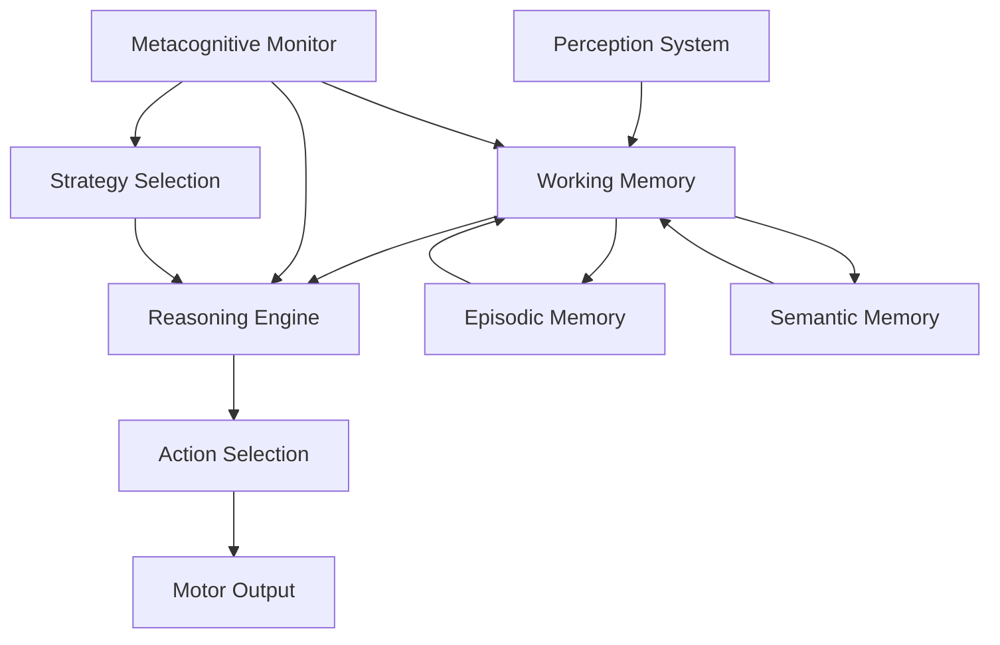

# Cognitive Architecture

Understanding the theoretical foundation of Cognito Simulation Engine is crucial for effective use and research applications.

## Overview

Cognito Simulation Engine implements a comprehensive cognitive architecture inspired by decades of research in cognitive science, neuroscience, and artificial intelligence. Our architecture goes beyond traditional neural network approaches to provide a structured, interpretable framework for AGI research.

## Core Architectural Principles

### 1. Multi-System Integration

The engine integrates multiple cognitive systems that work together to produce intelligent behavior:



### 2. Symbolic-Subsymbolic Hybrid

Our architecture combines:

- **Symbolic Processing**: Rule-based reasoning, logical inference, explicit knowledge representation
- **Subsymbolic Processing**: Activation spreading, constraint satisfaction, emergent patterns

### 3. Biologically-Inspired Constraints

The architecture respects known cognitive limitations:

- **Working Memory Capacity**: Miller's 7±2 limit with realistic capacity constraints
- **Attention Bottleneck**: Selective attention mechanisms with resource allocation
- **Memory Decay**: Realistic forgetting curves and consolidation processes
- **Processing Speed**: Bounded rationality with time constraints

## Architectural Components

### Perception-Action Loop

The fundamental cycle of cognitive processing:

1. **Perception**: Environmental input processing and feature extraction
2. **Attention**: Selective focus on relevant information
3. **Memory Access**: Retrieval of relevant stored knowledge
4. **Reasoning**: Inference and problem-solving processes
5. **Planning**: Goal-directed action sequence generation
6. **Action**: Motor output and environmental interaction
7. **Monitoring**: Performance evaluation and strategy adjustment

### Memory Systems Architecture

Based on Baddeley's Working Memory Model and Tulving's Memory Systems:

#### Working Memory

```python
class WorkingMemory:
    """
    Central executive with phonological loop, visuospatial sketchpad,
    and episodic buffer components.
    """
    capacity: int = 7  # Miller's magical number
    decay_rate: float = 0.1  # Information decay over time
    refresh_rate: float = 0.5  # Attention-based refreshing
```

#### Long-Term Memory

- **Episodic Memory**: Personal experiences with temporal context
- **Semantic Memory**: Factual knowledge and conceptual understanding
- **Procedural Memory**: Skills and automated behaviors

### Reasoning Architecture

Multi-strategy inference system:

#### Forward Chaining

- Data-driven reasoning from facts to conclusions
- Suitable for exploration and discovery tasks

#### Backward Chaining

- Goal-driven reasoning from desired outcomes to required facts
- Optimal for planning and problem-solving

#### Abductive Reasoning

- Hypothesis generation for explaining observations
- Essential for scientific thinking and creativity

### Attention Mechanisms

Selective attention system with:

- **Endogenous Control**: Top-down, goal-directed attention
- **Exogenous Control**: Bottom-up, stimulus-driven attention
- **Resource Management**: Computational resource allocation

## Cognitive Control

### Executive Functions

The cognitive control system manages:

1. **Inhibition**: Suppressing irrelevant or inappropriate responses
2. **Updating**: Maintaining and manipulating working memory contents  
3. **Shifting**: Flexible switching between mental sets or tasks

### Metacognition

Higher-order cognition about cognition:

- **Metacognitive Knowledge**: Understanding of cognitive processes
- **Metacognitive Regulation**: Control and monitoring of cognition
- **Strategy Selection**: Adaptive choice of cognitive strategies

## Agent Architecture Types

### CognitiveAgent: Full Architecture

Implements complete cognitive architecture with all systems integrated:

```python
class CognitiveAgent:
    def __init__(self):
        self.memory_manager = MemoryManager()
        self.inference_engine = InferenceEngine()
        self.attention_system = AttentionSystem()
        self.metacognitive_monitor = MetacognitiveMonitor()
        self.action_controller = ActionController()
```

### ReasoningAgent: Logic-Focused

Specialized for symbolic reasoning with enhanced inference capabilities:

- Expanded rule base capacity
- Multiple reasoning strategies
- Formal logic integration
- Proof generation capabilities

### LearningAgent: Adaptive Architecture  

Optimized for learning and skill acquisition:

- Experience-based learning mechanisms
- Skill level tracking and progression
- Adaptive strategy development
- Transfer learning capabilities

### MetaCognitiveAgent: Self-Reflective

Advanced self-awareness and cognitive monitoring:

- Real-time cognitive load assessment
- Strategy effectiveness evaluation
- Self-model maintenance and updating
- Cognitive bias detection and correction

## Theoretical Foundations

### ACT-R Integration

Adaptive Control of Thought-Rational principles:

- **Production Rules**: Condition-action pairs for procedural knowledge
- **Declarative Memory**: Chunk-based factual knowledge representation
- **Activation Spreading**: Memory retrieval through associative networks
- **Learning Mechanisms**: Strengthening through practice and reinforcement

### Global Workspace Theory

Consciousness and information integration:

- **Global Broadcasting**: Making information globally available
- **Competition**: Multiple processes competing for conscious access
- **Coalition Formation**: Temporary alliances of cognitive processes

### Dual Process Theory

System 1 (Fast) and System 2 (Slow) processing:

- **System 1**: Automatic, intuitive, low-effort processing
- **System 2**: Controlled, analytical, high-effort processing
- **Conflict Resolution**: Managing competition between systems

## Implementation Philosophy

### Modularity and Extensibility

- **Plug-and-Play Components**: Easy substitution of cognitive modules
- **Interface Standardization**: Consistent APIs across components
- **Hierarchical Organization**: Clear separation of concerns

### Research Orientation

- **Transparency**: All processes are inspectable and interpretable
- **Configurability**: Extensive parameter control for experimentation
- **Metrics Collection**: Comprehensive performance measurement
- **Reproducibility**: Deterministic simulation with random seed control

### AGI Readiness

The architecture is designed with AGI development in mind:

- **Scalability**: Efficient handling of complex cognitive tasks
- **Generality**: Domain-independent cognitive processes
- **Self-Improvement**: Metacognitive optimization capabilities
- **Safety Mechanisms**: Built-in monitoring and control systems

## Research Applications

### Cognitive Science Research

- **Hypothesis Testing**: Formal modeling of cognitive theories
- **Phenomenon Replication**: Simulating known cognitive effects
- **Parameter Exploration**: Investigating cognitive constraints
- **Individual Differences**: Modeling cognitive variation

### AI Development

- **Architecture Prototyping**: Testing new cognitive designs
- **Component Evaluation**: Comparing alternative implementations
- **Emergent Behavior Study**: Observing unexpected system behaviors
- **Safety Research**: Testing containment and alignment strategies

### Educational Applications

- **Cognitive Training**: Developing cognitive skill training programs
- **Learning Analytics**: Understanding learning processes
- **Adaptive Tutoring**: Personalized educational systems
- **Cognitive Assessment**: Measuring cognitive capabilities

## Future Directions

### Enhanced Biological Fidelity

- **Neural Implementation**: Connecting to neural network substrates
- **Developmental Models**: Implementing cognitive development
- **Emotional Integration**: Adding affective processing systems

### Advanced Capabilities

- **Creativity Systems**: Implementing creative problem-solving
- **Social Cognition**: Multi-agent interaction and theory of mind
- **Language Processing**: Natural language understanding and generation
- **Embodied Cognition**: Integration with robotic systems

---

**Next**: Learn about [Memory Systems](memory-systems.md) in detail, or explore [Agent Design](agent-design.md) principles.
