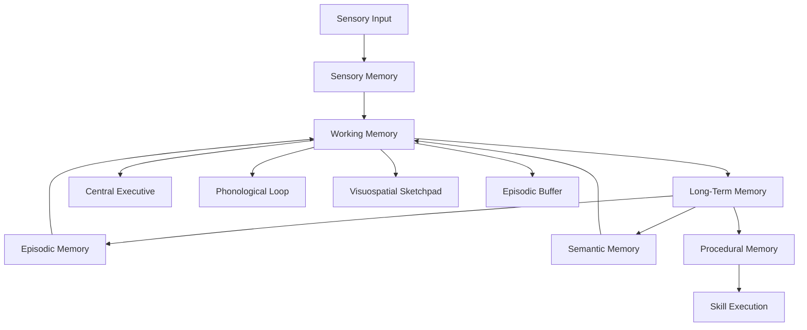

# Memory Systems

Memory is the foundation of intelligence, enabling agents to learn from experience, maintain context, and make informed decisions. Cognito Simulation Engine implements a sophisticated multi-store memory architecture based on cutting-edge cognitive science research.

## Memory Architecture Overview

Our memory system implements a biologically-inspired, multi-component architecture:



## Working Memory System

### Core Architecture

Working memory serves as the cognitive workspace where active information processing occurs. Our implementation follows Baddeley's multi-component model:

```python
from cognito_sim_engine import MemoryManager, MemoryItem, MemoryType

# Create memory manager with cognitive constraints
memory = MemoryManager(
    working_capacity=7,  # Miller's 7±2 rule
    decay_rate=0.1,      # Information decay per second
    refresh_rate=2.0     # Attention refresh frequency
)

# Add item to working memory
item = MemoryItem(
    content="Current goal: solve puzzle",
    memory_type=MemoryType.WORKING,
    importance=0.8,
    activation_level=1.0
)

memory.store_memory(item)
```

### Capacity Limitations

Working memory capacity is strictly limited to simulate human cognitive constraints:

- **Span Limit**: 7±2 items (configurable)
- **Decay Function**: Exponential decay over time
- **Interference**: New items can displace existing ones
- **Attention Refresh**: Active maintenance through attention

### Components

#### Central Executive

The supervisory system that:

- Controls attention allocation
- Manages information flow between components
- Coordinates cognitive strategies
- Monitors and regulates processing

#### Phonological Loop

Specialized for verbal and acoustic information:

- **Phonological Store**: Temporary storage of speech-based information
- **Articulatory Rehearsal**: Subvocal repetition to maintain information
- **Capacity**: Approximately 2-second duration limit

#### Visuospatial Sketchpad

Handles visual and spatial information:

- **Visual Cache**: Storage of visual form and color information
- **Inner Scribe**: Processing of spatial and movement information
- **Capacity**: 3-4 visual objects or spatial locations

#### Episodic Buffer

Integrates information from multiple sources:

- **Multimodal Integration**: Combines visual, auditory, and semantic information
- **Conscious Access**: Interface to conscious awareness
- **Temporal Binding**: Links information across time

## Long-Term Memory Systems

### Episodic Memory

Stores personally experienced events with rich contextual detail:

```python
from cognito_sim_engine import EpisodicMemory, MemoryItem

episodic = EpisodicMemory()

# Store an episode
episode = MemoryItem(
    content="Solved the tower puzzle using recursive strategy",
    memory_type=MemoryType.EPISODIC,
    importance=0.7,
    context={
        "timestamp": "2025-07-13T10:30:00",
        "location": "laboratory",
        "emotional_state": "satisfaction",
        "strategy_used": "recursive_decomposition",
        "outcome": "success"
    }
)

episode_id = episodic.store_episode(episode)
```

#### Key Features

- **Temporal Context**: When events occurred
- **Spatial Context**: Where events took place  
- **Emotional Context**: Affective state during encoding
- **Causal Context**: Relationships between events
- **Autobiographical Nature**: Self-referential memories

#### Retrieval Mechanisms

- **Temporal Retrieval**: Accessing memories by time
- **Contextual Cuing**: Using environmental cues
- **Associative Retrieval**: Following memory links
- **Reconstructive Process**: Rebuilding memories from fragments

### Semantic Memory

Contains factual knowledge and conceptual understanding:

```python
from cognito_sim_engine import SemanticMemory, ConceptNode

semantic = SemanticMemory()

# Add conceptual knowledge
concepts = [
    ConceptNode("puzzle", properties=["challenging", "solvable", "logical"]),
    ConceptNode("strategy", properties=["systematic", "goal-directed"]),
    ConceptNode("recursion", properties=["self-similar", "divide-and-conquer"])
]

for concept in concepts:
    semantic.add_concept(concept)

# Create semantic relationships
semantic.add_relationship("recursion", "is_a", "strategy")
semantic.add_relationship("puzzle", "requires", "strategy")
```

#### Knowledge Representation

- **Concepts**: Abstract categories and their properties
- **Relations**: Connections between concepts
- **Hierarchies**: Taxonomic and part-whole structures
- **Schemas**: Structured knowledge frameworks

#### Organization Principles

- **Categorical Structure**: Superordinate, basic, and subordinate levels
- **Semantic Networks**: Interconnected concept nodes
- **Feature-Based**: Concepts defined by properties
- **Prototype Theory**: Central tendencies and typicality effects

### Procedural Memory

Stores skills, habits, and automated behaviors:

```python
from cognito_sim_engine import ProceduralMemory, Skill

procedural = ProceduralMemory()

# Define a cognitive skill
problem_solving = Skill(
    name="recursive_problem_solving",
    steps=[
        "identify_base_case",
        "decompose_problem", 
        "apply_recursion",
        "combine_solutions"
    ],
    proficiency=0.7,
    automaticity=0.5
)

procedural.learn_skill(problem_solving)
```

#### Characteristics

- **Implicit Nature**: Often unconscious and automatic
- **Gradual Acquisition**: Learning through practice and repetition
- **Resistance to Forgetting**: Highly durable once established
- **Transfer Effects**: Skills can generalize across contexts

## Memory Processes

### Encoding

The process of transforming information into storable format:

#### Encoding Strategies

- **Elaborative Encoding**: Connecting new information to existing knowledge
- **Visual Encoding**: Creating mental images and spatial representations
- **Organizational Encoding**: Structuring information into meaningful patterns
- **Self-Referential Encoding**: Relating information to personal experience

#### Factors Affecting Encoding

- **Attention Level**: Higher attention improves encoding quality
- **Processing Depth**: Deeper semantic processing enhances retention
- **Emotional Significance**: Emotional content receives encoding priority
- **Repetition Effects**: Multiple exposures strengthen memory traces

### Storage

Maintaining information in memory over time:

#### Consolidation Process

```python
# Memory consolidation simulation
def consolidate_memories(memory_manager, time_elapsed):
    """Simulate memory consolidation over time."""
    for memory_id, memory in memory_manager.episodic_memory.memories.items():
        if time_elapsed > memory.consolidation_threshold:
            # Transfer to long-term storage
            memory.consolidation_level += 0.1
            memory.interference_resistance += 0.05
            
            # Semantic extraction
            if memory.consolidation_level > 0.8:
                semantic_content = extract_semantic_content(memory)
                memory_manager.semantic_memory.integrate(semantic_content)
```

#### Storage Mechanisms

- **Synaptic Consolidation**: Protein synthesis-dependent stabilization
- **Systems Consolidation**: Gradual cortical storage integration
- **Interference Resistance**: Protection against competing memories
- **Capacity Management**: Forgetting mechanisms to prevent overload

### Retrieval

Accessing stored information when needed:

#### Retrieval Types

```python
# Different retrieval modes
class MemoryRetrieval:
    def recall(self, cue):
        """Generate information from memory without external cues."""
        pass
    
    def recognition(self, stimulus):
        """Identify previously encountered information."""
        pass
    
    def cued_recall(self, cue):
        """Use external cues to trigger memory retrieval."""
        pass
    
    def free_recall(self):
        """Retrieve information without specific cues."""
        pass
```

#### Retrieval Processes

- **Activation Spreading**: Spreading activation through associative networks
- **Context Reinstatement**: Recreating encoding context to aid retrieval
- **Competitive Retrieval**: Competition between similar memories
- **Retrieval Inhibition**: Suppressing irrelevant memories

## Memory Dynamics

### Forgetting Mechanisms

Forgetting is not just passive decay but serves important cognitive functions:

#### Forgetting Functions

- **Interference Reduction**: Reducing competition between memories
- **Generalization**: Extracting general principles from specific experiences
- **Adaptive Updating**: Prioritizing current over outdated information
- **Cognitive Efficiency**: Focusing on relevant information

#### Forgetting Curves

```python
import numpy as np

def ebbinghaus_forgetting_curve(t, initial_strength=1.0, decay_rate=0.1):
    """Ebbinghaus forgetting curve implementation."""
    return initial_strength * np.exp(-decay_rate * t)

def power_law_forgetting(t, initial_strength=1.0, decay_rate=0.5):
    """Power law forgetting for semantic memory."""
    return initial_strength * (t + 1) ** (-decay_rate)
```

### Memory Interactions

#### Cross-System Interactions

- **Working-Episodic**: Episodes provide context for current processing
- **Working-Semantic**: Semantic knowledge guides interpretation
- **Episodic-Semantic**: Episodes contribute to semantic knowledge
- **Procedural-Declarative**: Skills incorporate factual knowledge

#### Memory Binding

- **Feature Binding**: Combining features into coherent objects
- **Temporal Binding**: Linking events across time
- **Cross-Modal Binding**: Integrating information across sensory modalities
- **Contextual Binding**: Associating content with environmental context

## Advanced Memory Features

### Metamemory

Knowledge and monitoring of memory processes:

```python
class MetamemoryMonitor:
    def __init__(self):
        self.confidence_ratings = {}
        self.strategy_effectiveness = {}
        self.memory_load_assessment = {}
    
    def assess_memory_confidence(self, memory_id):
        """Assess confidence in memory accuracy."""
        memory = self.get_memory(memory_id)
        factors = [
            memory.vividness,
            memory.consistency,
            memory.source_reliability,
            memory.retrieval_fluency
        ]
        return np.mean(factors)
    
    def select_retrieval_strategy(self, task_demands):
        """Choose optimal retrieval strategy for current task."""
        if task_demands.speed_priority:
            return "direct_access"
        elif task_demands.accuracy_priority:
            return "generate_and_test"
        else:
            return "elaborative_search"
```

### Memory Reconstruction

Memories are not static recordings but dynamic reconstructions:

#### Reconstruction Processes

- **Schema-Based Reconstruction**: Using knowledge frameworks to fill gaps
- **Inference Integration**: Adding plausible inferences to memory traces
- **Source Monitoring**: Distinguishing between different memory sources
- **Reality Monitoring**: Discriminating between perceived and imagined events

### Adaptive Memory Systems

Memory systems that adapt to task demands and experience:

```python
class AdaptiveMemorySystem:
    def __init__(self):
        self.allocation_strategy = "balanced"
        self.priority_weights = {
            "recency": 0.3,
            "frequency": 0.3, 
            "importance": 0.4
        }
    
    def adapt_to_task(self, task_type):
        """Adapt memory allocation to task requirements."""
        if task_type == "learning":
            self.priority_weights["importance"] = 0.6
        elif task_type == "planning":
            self.priority_weights["recency"] = 0.5
        elif task_type == "skill_execution":
            self.activate_procedural_dominance()
```

## Research Applications

### Memory Research

- **Capacity Studies**: Investigating working memory limitations
- **Forgetting Research**: Understanding forgetting mechanisms and functions
- **Learning Studies**: Examining memory formation and consolidation
- **Individual Differences**: Modeling memory variations across individuals

### Clinical Applications

- **Memory Disorders**: Simulating amnesia, dementia, and other conditions
- **Rehabilitation**: Developing memory training and support systems
- **Assessment**: Creating memory evaluation tools
- **Intervention**: Testing memory enhancement strategies

### AI Development

- **Learning Systems**: Implementing adaptive learning algorithms
- **Knowledge Management**: Organizing and retrieving large knowledge bases
- **Context Awareness**: Maintaining situational awareness over time
- **Transfer Learning**: Applying knowledge across different domains

## Performance Optimization

### Memory Efficiency

- **Compression**: Reducing memory storage requirements
- **Indexing**: Fast access to relevant memories
- **Garbage Collection**: Removing obsolete or low-value memories
- **Load Balancing**: Distributing memory load across systems

### Scalability Considerations

- **Hierarchical Organization**: Multi-level memory structures
- **Parallel Processing**: Concurrent memory operations
- **Incremental Learning**: Adding knowledge without catastrophic forgetting
- **Memory Consolidation**: Efficient long-term storage management

---

**Next**: Explore the [Reasoning Engine](reasoning-engine.md) that operates on these memory systems, or learn about [Agent Design](agent-design.md) principles.
